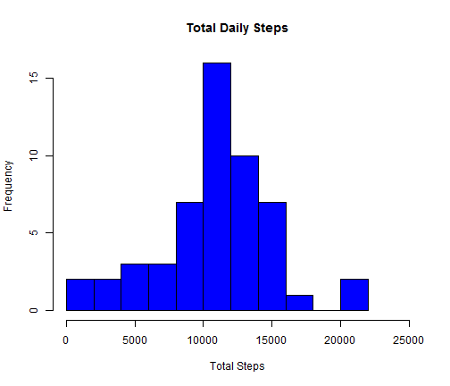
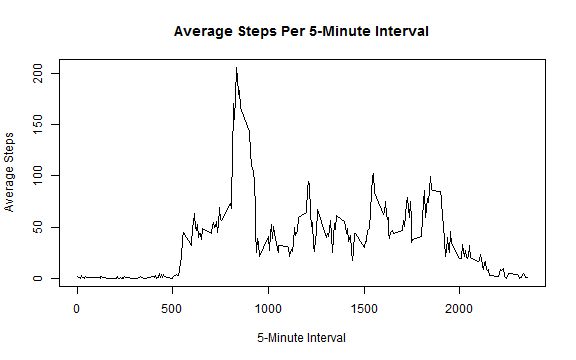
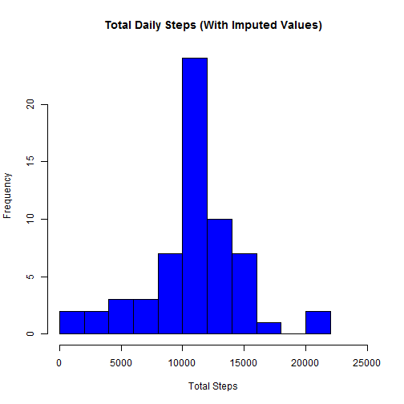
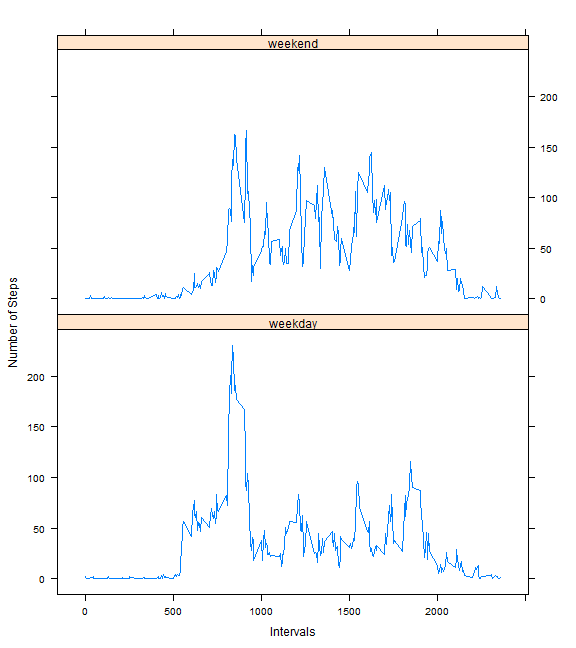

Reproducible Research -- Peer Assessment 1
========================================================

Activity monitoring devices such as fitbit, Jawbone Up, and Nike Fuelband record users' movement throughout the day, providing copious data about people's movement.

This assignment looks at data from one individual activity monitoring device to:

- analyze daily activity  patterns, 
- evaluate how missing data points affect the analysis, and 
- visualize the difference between weekday and weekend activity patterns.

The data contains activity monitoring data taken at 5-minute intervals from one individual over the a two month period (October through November).

The data is available as a zip file on the Github repository.  The code in this document unzips and reads the activity data.  The data originally comes from the Coursera Reproducible Research website: [Activity Monitoring Data](https://d396qusza40orc.cloudfront.net/repdata%2Fdata%2Factivity.zip).

## Loading and processing the data

The data is a .csv file with three columns and 17,568 records.  The code chuck below reads the .csv  file into a dataframe (named "act") and summarizes the structure of the dataframe.


```r
unzip("activity.zip")
act<-read.csv("activity.csv")
str(act)
```

```
## 'data.frame':	17568 obs. of  3 variables:
##  $ steps   : int  NA NA NA NA NA NA NA NA NA NA ...
##  $ date    : Factor w/ 61 levels "2012-10-01","2012-10-02",..: 1 1 1 1 1 1 1 1 1 1 ...
##  $ interval: int  0 5 10 15 20 25 30 35 40 45 ...
```

The file constains three fields:

1. steps: the total number of steps recorded during a five-minute interval
2. date: the date in Year-Month-Day format
3. interval: five minute interval, e.g. 815 equals 8:15 am.

No reformatting or transformations were performed at this stage of the assignment.

## What is the mean total number of steps taken per day?

The total daily steps in the dataset follows a roughly normal distribution, as shown in the histogram below.


```r
tot.daily<-aggregate(steps~date,data=act,sum) #sums steps by day
#plots histogram of total steps by day
hist(tot.daily$step,breaks=10,main="Total Daily Steps",xlab="Total Steps",col="blue",xlim=c(0,25000))
```

 


```r
#the following lines calculate the mean and median total number of daily steps
mn<-format(mean(tot.daily$step),big.mark=",",scientific=FALSE) 
md<-format(median(tot.daily$step),big.mark=",",scientific=FALSE)
```

The mean total daily steps is 10,766 and the median total daily steps is 10,765.

## What is the average daily activity pattern?

The figure shows the average steps per 5 minute interval across all days.  It shows  that, on average, activity peaks in the morning.


```r
act.pat<-aggregate(steps~interval,data=act,mean) #average steps per interval

#plots average steps per interval
plot(act.pat$steps~act.pat$interval,type="l",main="Average Steps Per 5-Minute Interval",xlab="5-Minute Interval",ylab="Average Steps")
```

 

```r
#identifies interval with highest average steps
mx<-act.pat$interval[which.max(act.pat$steps)] 
```

The time interval 835 had the highest average number of steps.

## Imputing missing values

The data contains a number of missing values.


```r
#provides a summary of file and counts rows with missing data
summary(act)
```

```
##      steps               date          interval   
##  Min.   :  0.0   2012-10-01:  288   Min.   :   0  
##  1st Qu.:  0.0   2012-10-02:  288   1st Qu.: 589  
##  Median :  0.0   2012-10-03:  288   Median :1178  
##  Mean   : 37.4   2012-10-04:  288   Mean   :1178  
##  3rd Qu.: 12.0   2012-10-05:  288   3rd Qu.:1766  
##  Max.   :806.0   2012-10-06:  288   Max.   :2355  
##  NA's   :2304    (Other)   :15840
```

```r
mv<-format(sum(is.na(act)),big.mark=",",scientific=FALSE)
```

The dataset contains 2,304 rows with  missing data, all of which are in the "steps" field.  The code chunk below inputes values for each missing value. Missing values are imputed by calculating the mean value for each 5-minute time interval across all days. This method was selected based on the plot above, which shows how activity patterns vary across the day. 


```r
act.im<-act #makes a copy of the dataframe for transformation

#creates a dataframe of average steps/interval
mns<-aggregate(steps~interval,act,mean) 

#loops through the data;if missing data, fills in mean steps for that interval
# if not missing, keeps original value

for (i in 1:length(act.im$steps)){
        act.im$steps[[i]]<-ifelse(is.na(act.im$steps[[i]]),
                                  mns[mns$interval==act.im$interval[[i]],"steps"],act.im$steps[[i]])
}

#creates a dataframe with total steps per day, using imputed data
tot.daily.mv<-aggregate(steps~date,data=act.im,sum)
```

The addition of imputed values does not appear to affect the data much.  The histogram below shows a similar distribution as the data without imputed values.
        
        

```r
#plot total daily steps using imputed values
hist(tot.daily.mv$step,breaks=10,main="Total Daily Steps (With Imputed Values)",
     xlab="Total Steps",col="blue",xlim=c(0,25000))
```

 

```r
#calculate the mean and median daily steps with imputed values
mni<-format(mean(tot.daily.mv$step),big.mark=",",scientific=FALSE)
mdi<-format(median(tot.daily.mv$step),big.mark=",",scientific=FALSE) 
```

The mean and median with inputed values -- 10,766  and 10,766 respectively -- is similar to the mean and median with missing values.  This might be because many of the missing values occur in the early morning hours, where the average numbers of steps are close to zero.

## Are there any differences in activity patterns between weekdays and weekends?

The data shows differences in weekday and weekend activity patterns.

The code chuck below labels each day as weekday or weekend, and plots the results.


```r
#create a new variable for "weekday" and "weekend"
act.im$dayWeek<-weekdays(as.Date(act.im$date))
act.im$weekDayEnd<-ifelse(act.im$dayWeek %in% c("Saturday","Sunday"),"weekend","weekday")

#calculate average steps per interval using inputed values dataset
wk.act<-aggregate(steps~interval+weekDayEnd,data=act.im,mean)

#create two plots comparing average steps per interval for weekdays and weekends
library(lattice)

xyplot(wk.act$steps~wk.act$interval|wk.act$weekDayEnd,type="l",layout=c(1,2),
       ylab="Number of Steps",xlab="Intervals")
```

 

The plot above shows less morning peaking on the weekends, and a more even distribution of average steps throughout the day compared to the weekday activity patterns.

## Conclusion

The analysis of the data shows that the average total daily steps is 10,766. Average activity peaks in the morning, although this peak is less pronounced on weekends than on weekdays.

Missing values do not appear to have a large affect on the results; however, given how weekend and weekday activity patterns change, further work might examine imputation methods that distinguish between weekdays and weekends.


